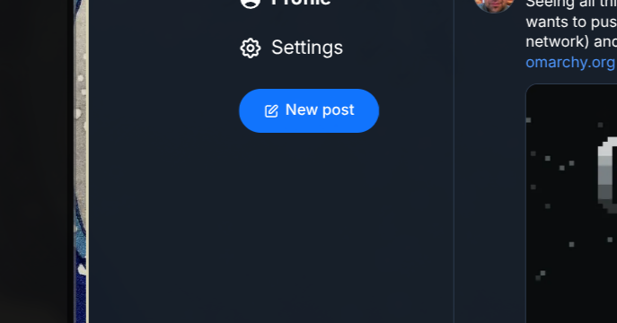

# bsky

Post to Bluesky from anywhere on Omarchy. Hit a global shortcut, type (or paste
a screenshot), Enter. A tiny composer overlay for the Omarchy Quattro shell.



## Features

- **Bar icon and global shortcut** composer overlay — summon from either, Esc closes
- **Text posts** with a 300-character grapheme counter, link, `#hashtag` and
  `@mention` facets (clickable on Bluesky)
- **Clipboard images** — an image on the clipboard is auto-attached when the
  composer opens (an image you just posted is not re-attached until the
  clipboard changes); up to 4 images per post, each with alt text and correct
  aspect ratio. GIF/BMP clipboard images are converted to PNG via ffmpeg.
- **Reply & quote** — include a `bsky.app` post URL in your text, then hit
  *Reply* or *Quote*
- **Link cards** — with a plain URL and no image, *Link card* fetches
  OpenGraph data (title, description, thumbnail) for an embed
- **Session management** — access tokens are cached and refreshed
  automatically; the app password is only used to (re-)login

## Install

```sh
omarchy plugin add https://github.com/thenitai/bsky.git --enable
```

Interactive installation asks whether the butterfly icon belongs in the left,
center or right bar section. The default is right. Non-interactive installs
using `--yes` use that default without prompting.

If you installed an older overlay-only release, re-enable it once with the bar
section you want:

```fish
omarchy plugin disable thenitai.bsky
omarchy plugin enable thenitai.bsky --section right
```

Replace `right` with `left` or `center` as preferred.

## Setup

1. Create an app password at **bsky.app → Settings → App passwords** (never
   use your main password).
2. Click the Bluesky bar icon or press the composer shortcut — the first run
   shows the sign-in form.
   Enter your handle (e.g. `alice.bsky.social`) and the app password.
3. Optional: enter a custom PDS URL if your account is not on `bsky.social`.

Credentials are stored in `~/.config/omarchy-bsky/` (directory mode `0700`,
secret files `0600`), never in `shell.json`.

## Global shortcut

The composer opens with a global shortcut — **SUPER + B** by default. The
plugin registers it with Hyprland at runtime (via `hyprctl eval`), so no
manual binding is needed; it is re-applied whenever the shell starts or
Hyprland reloads its config.

Change it in the plugin's **Settings** view: type a combo like
`SUPER + SHIFT + P` and hit *Apply*. Combos already assigned to another
Hyprland action are rejected with the conflicting action's name, and
leaving the field empty disables the shortcut. The choice persists across
restarts.

## Bar icon

The Bluesky icon provides a discoverable fallback when the global shortcut is
disabled or unavailable. Click it to open or close the same composer overlay.

## Keyboard

| Key | Action |
| --- | --- |
| `Esc` | Close (draft is kept) |
| `Ctrl+Enter` | Post |
| `Ctrl+V` | Attach clipboard image, or paste text at the cursor |
| `Ctrl+A/C/X/Z` | Standard text editing |
| `Super+A/V/C/X/Z` | Same, for Super-mapped system shortcuts — requires the triggering Hyprland bind to opt in with `{ allow_input_capture = true }` |
| Click outside | Close |

## API notes

Everything goes through the standard AT Protocol XRPC endpoints on your PDS
(`createSession`, `refreshSession`, `uploadBlob`, `createRecord`) plus
unauthenticated AppView reads (`getProfile`, `getPostThread`) on
`public.api.bsky.app` for reply/quote resolution and mention DIDs. The access
JWT is handed to `curl` through a `0600` temp header file, never through argv
or the environment.

Limits enforced client-side: 300 graphemes, 4 images, 5 links, images under
1 MB in JPEG/PNG/WebP.

Not implemented (yet): video embeds (requires the separate video upload
service), self-labels, scheduled posts.

## Remove

```sh
omarchy plugin remove thenitai.bsky
rm -rf ~/.config/omarchy-bsky   # credentials
```

Revoke the app password in bsky.app settings when you're done.

## License

MIT
